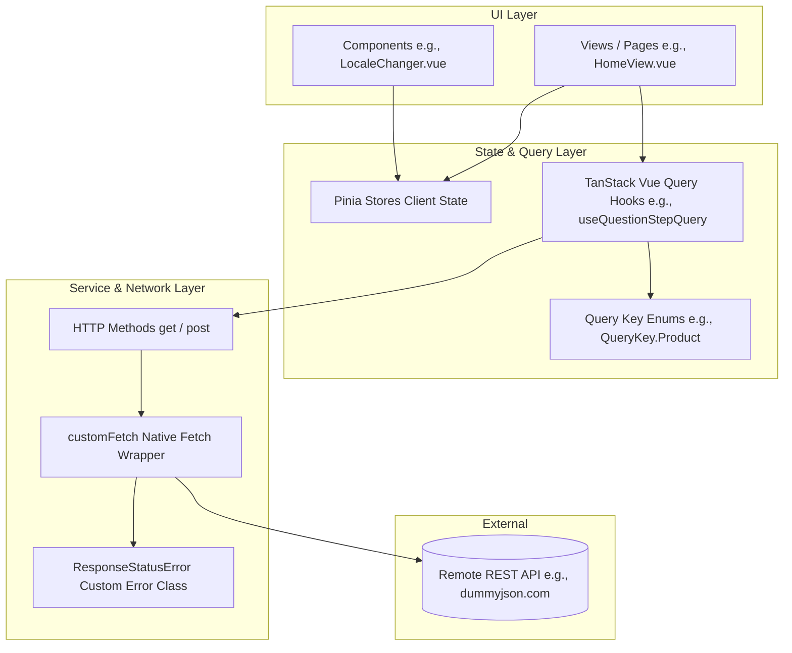

# 🚀 Vue 3 Enterprise Starter Template

<p align="center">
  
</p>

<p align="center">
  <strong>A production-ready, highly opinionated, full-featured enterprise frontend boilerplate.</strong><br>
  Built with Vue 3 (Composition API & `<script setup>`), TypeScript, Vite 4, Pinia, TanStack Vue Query, Vue Router, Cypress, Vitest, Sass, and Vue I18n.
</p>

<p align="center">
  <a href="https://github.com/vuejs/core"></a>
  <a href="https://github.com/vitejs/vite"></a>
  <a href="https://github.com/microsoft/TypeScript"></a>
  <a href="https://github.com/vuejs/pinia"></a>
  <a href="https://github.com/tanstack/query"></a>
  <a href="https://github.com/cypress-io/cypress"></a>
  <a href="https://github.com/vitest-dev/vitest"></a>
  <a href="https://github.com/sass/sass"></a>
  <a href="https://github.com/eslint/eslint"></a>
  <a href="https://github.com/prettier/prettier"></a>
  <a href="./LICENSE"></a>
</p>

---

## 📑 Table of Contents

- [Overview](#-overview)
- [Key Features](#-key-features)
- [Tech Stack](#-tech-stack)
- [Architecture & Data Flow](#-architecture--data-flow)
- [Directory Structure](#-directory-structure)
- [Getting Started](#-getting-started)
  - [Prerequisites](#prerequisites)
  - [Installation](#installation)
  - [Environment Variables](#environment-variables)
  - [Running Development Server](#running-development-server)
- [Available Scripts](#-available-scripts)
- [Core Workflows & Patterns](#-core-workflows--patterns)
  - [1. Data Fetching & Server State (TanStack Query)](#1-data-fetching--server-state-tanstack-query)
  - [2. Type-Safe HTTP Client (`services/http`)](#2-type-safe-http-client-serviceshttp)
  - [3. Internationalization (Vue I18n) & RTL Support](#3-internationalization-vue-i18n--rtl-support)
  - [4. Routing, SEO & Dynamic Titles](#4-routing-seo--dynamic-titles)
  - [5. Testing Strategy (Cypress & Vitest)](#5-testing-strategy-cypress--vitest)
  - [6. Keycloak Styles Bundler](#6-keycloak-styles-bundler)
- [Configuration Reference](#-configuration-reference)
- [Contributing](#-contributing)
- [Authors & Acknowledgments](#-authors--acknowledgments)
- [License](#-license)

---

## 🌟 Overview

This repository provides an enterprise-grade starter boilerplate designed for scalable, maintainable, and high-performance web applications. It brings together modern Vue 3 tooling, strict TypeScript typing, decoupled service layers, automated multi-tier testing, advanced internationalization, and optimized asset bundling.

Whether you are kickstarting an enterprise dashboard, customer portal, SaaS application, or single-page app (SPA), this template provides solid foundations, consistent design patterns, and clean separation of concerns out of the box.

---

## ⚡ Key Features

- **⚡ Blazing Fast Build & HMR**: Powered by [Vite 4](https://vitejs.dev/) with instantaneous Hot Module Replacement and ESNext build targets.
- **🛡️ Strict Type Safety**: End-to-end TypeScript compilation with `vue-tsc`, global component typing (`components.d.ts`), and strict tsconfig rules.
- **🧩 Vue 3 Composition API**: Component architecture leveraging `<script setup lang="ts">`, reactive refs, and lifecycle hooks.
- **🍍 Pinia State Management**: Lightweight, intuitive, and fully type-safe central store management.
- **🔄 Server State with TanStack Vue Query**: Automatic caching (3-minute default stale time), background refetching control, reactive query invalidation, and query key enums.
- **🌐 Internationalization (Vue I18n 9 + Unplugin)**:
  - Compile-time message extraction via `@intlify/unplugin-vue-i18n`.
  - Locale switching with automatic `localStorage` persistence.
  - Dynamic `document.documentElement` `lang` and `dir` (LTR/RTL) attribute synchronization.
  - Localized datetime formatting.
  - Translation key auditing via `vue-i18n-extract`.
- **🧪 Multi-Tier Automated Testing Suite**:
  - **Cypress E2E Testing**: Full end-to-end integration flows with custom selectors and network mocking via `cy.intercept`.
  - **Cypress Component Testing**: Isolated component mounting and testing via `@vue/test-utils` and custom `cy.dataCy()` / `cy.vueWrapper()` commands.
  - **Vitest**: Lightning-fast unit testing running in a `happy-dom` lightweight DOM environment.
  - **start-server-and-test**: Automated CI/CD server orchestration.
- **🎨 Modern SCSS & CSS Remedy**:
  - CSS Remedy base normalization for consistent cross-browser styling, box-sizing, and responsive media embeds.
  - SCSS modular structure with scoped component styles.
- **🔐 Standalone Keycloak Theme Bundling**: Pre-configured Vite library build (`vite-keycloak.config.js`) for exporting custom Keycloak authentication theme styles.
- **📱 PWA-Ready Icons & Manifest**: Full set of multi-resolution Apple touch icons, Android icons, favicons, and `manifest.json`.
- **🧹 Code Quality & Linting**: ESLint + Prettier suite with Vue 3 essential rules, TypeScript strict rules, Cypress plugin, and TanStack Query lint rules.

---

## 🛠️ Tech Stack

| Technology | Role | Documentation |
| :--- | :--- | :--- |
| **[Vue 3](https://vuejs.org/)** (v3.2.47) | Progressive JavaScript Framework (Composition API) | [Vue Docs](https://vuejs.org/guide/introduction.html) |
| **[TypeScript](https://www.typescriptlang.org/)** (v4.9.5) | Strongly typed JavaScript | [TypeScript Docs](https://www.typescriptlang.org/docs/) |
| **[Vite](https://vitejs.dev/)** (v4.1.4) | Next-Generation Frontend Tooling & Dev Server | [Vite Docs](https://vitejs.dev/guide/) |
| **[Pinia](https://pinia.vuejs.org/)** (v2.0.33) | Intuitive, type-safe store for Vue | [Pinia Docs](https://pinia.vuejs.org/) |
| **[TanStack Vue Query](https://tanstack.com/query/latest)** (v4.26.1) | Async state management & server data caching | [Vue Query Docs](https://tanstack.com/query/latest/docs/vue/overview) |
| **[Vue Router](https://router.vuejs.org/)** (v4.1.6) | Official client-side router for Vue 3 | [Vue Router Docs](https://router.vuejs.org/) |
| **[Vue I18n](https://vue-i18n.intlify.dev/)** (v9.2.2) | Internationalization framework for Vue.js | [Vue I18n Docs](https://vue-i18n.intlify.dev/) |
| **[Cypress](https://www.cypress.io/)** (v10.11.0) | E2E and Component Testing Framework | [Cypress Docs](https://docs.cypress.io/) |
| **[Vitest](https://vitest.dev/)** (v0.29.2) | Fast Vite-native unit test runner | [Vitest Docs](https://vitest.dev/guide/) |
| **[Sass](https://sass-lang.com/)** (v1.58.3) | CSS preprocessor with nesting and mixins | [Sass Docs](https://sass-lang.com/documentation/) |
| **[ESLint](https://eslint.org/)** (v8.35.0) | Pluggable JavaScript and TypeScript linter | [ESLint Docs](https://eslint.org/docs/latest/) |
| **[Prettier](https://prettier.io/)** (v2.8.4) | Opinionated code formatter | [Prettier Docs](https://prettier.io/docs/en/) |
| **[vue-i18n-extract](https://github.com/pixari/vue-i18n-extract)** (v2.0.7) | Static analysis tool for translation keys | [GitHub Repository](https://github.com/pixari/vue-i18n-extract) |

---

## 🏗️ Architecture & Data Flow

The project strictly follows the **Separation of Concerns** principle. UI components never make raw HTTP calls directly. Instead, data flows through clear, type-safe abstraction layers:



### Key Architectural Rules

1. **Components (`src/components/`, `src/views/`)**: Handle UI rendering, reactive bindings, user interaction, and transition animations.
2. **Query Hooks (`src/queries/`)**: Encapsulate async queries/mutations with `@tanstack/vue-query`. Query keys are strongly typed via enums.
3. **HTTP Service (`src/services/http/`)**: Encapsulates `fetch` operations, query string serialization, headers, and request options. Throws `ResponseStatusError` on non-2xx responses.
4. **Plugins (`src/plugins/`)**: Initialize and configure plugins (Vue Router, Pinia, Vue Query, Vue I18n) cleanly before registering them on the Vue application instance.
5. **Utilities (`src/util/`)**: Pure helper functions for browser APIs (`localStorage`, `document.documentElement`).

---

## 📂 Directory Structure

```text
.
├── .browserslistrc          # Browser compatibility matrix
├── .env                     # Environment variables (VITE_API, etc.)
├── .eslintignore            # Files ignored by ESLint
├── .eslintrc.js             # ESLint configuration with Vue, TS, and Cypress rules
├── .gitignore               # Git ignored paths
├── .prettierrc              # Prettier formatting rules
├── README.md                # Project documentation
├── index.html               # Main HTML entry point with PWA meta & favicon links
├── package.json             # Scripts, dependencies, and project metadata
├── tsconfig.json            # TypeScript compiler configuration & path aliases
├── vite.config.ts           # Main Vite application configuration (port 6429)
├── vite-keycloak.config.js  # Dedicated Vite bundler for Keycloak custom styles
├── cypress.config.ts        # Cypress configuration for E2E and Component testing
├── cypress.d.ts             # Cypress custom commands TypeScript declarations
├── env.d.ts                 # Vite client type references
├── cypress/                 # Cypress test suites and fixtures
│   ├── e2e/                 # End-to-End test specs (*.cy.ts)
│   │   └── home.cy.ts       # E2E test verifying API interception and navigation
│   ├── fixtures/            # Static test mock data (JSON fixtures)
│   │   └── data.json        # Mock response fixture
│   ├── support/             # Cypress support files
│   │   ├── commands.ts      # Custom commands (e.g., cy.dataCy)
│   │   ├── component-index.html # Mount template for component tests
│   │   ├── component.ts     # Component testing setup and global styles
│   │   └── e2e.ts           # E2E support entry file
│   └── tsconfig.json        # TypeScript configuration for Cypress tests
├── public/                  # Static assets served at root
│   ├── android-icon-*.png   # Multi-density Android icons
│   ├── apple-icon-*.png     # Multi-density Apple touch icons
│   ├── favicon-*.png        # Multi-size favicons (16x16, 32x32, 96x96, .ico)
│   ├── browserconfig.xml    # Windows tile configuration
│   └── manifest.json        # Web App Manifest for PWA installation
└── src/                     # Application source code
    ├── App.vue              # Root Vue component with navigation & LocaleChanger
    ├── components.d.ts      # Global component declarations for vue-tsc
    ├── keycloak.ts          # Keycloak theme entry point
    ├── main.ts              # Application bootstrap entry point
    ├── shims-vue.d.ts       # Shims for *.vue, *.svg, and *.png modules
    ├── components/          # Reusable UI components
    │   ├── LocaleChanger.vue # Dropdown component for live language switching
    │   └── __tests__/       # Component unit/integration tests
    │       └── LocaleChanger.cy.ts # Cypress component test for language switch
    ├── const/               # Application constants & enums
    │   └── locale.ts        # LocaleCode enum & LOCALE configuration (names, dir)
    ├── locales/             # Internationalization message bundles
    │   ├── en-US.json       # English translations
    │   └── zh-CN.json       # Simplified Chinese translations
    ├── plugins/             # Application plugin initializers
    │   ├── i18n.ts          # Vue I18n instance with fallback and datetime formats
    │   ├── queryClient.ts   # TanStack QueryClient with default cache options
    │   └── router.ts        # Vue Router instance with scroll behavior & page titles
    ├── queries/             # Server state queries & mutations
    │   ├── QueryKey.enum.ts # Strongly typed query key enums
    │   └── useProductQuery.ts # Vue Query hook using HTTP service
    ├── router/              # Route definitions & enums
    │   ├── routes.enum.ts   # Route names enum
    │   └── routes/          # Modular route records
    │       ├── homeRoute.ts # Home route definition with SEO meta
    │       ├── index.ts     # Aggregated route list
    │       └── notFound.ts  # Catch-all 404 route definition
    ├── services/            # Core business & infrastructure services
    │   └── http/            # Native Fetch-based HTTP Client
    │       ├── README.md    # HTTP service usage documentation
    │       ├── index.ts     # Public exports for HTTP service
    │       ├── client/      # Internal Fetch wrapper
    │       │   └── customFetch.ts # Custom fetch rejecting on HTTP error status
    │       ├── errors/      # Custom HTTP errors
    │       │   └── ResponseStatusError.ts # Error class holding status code
    │       ├── methods/     # REST method implementations
    │       │   ├── get.ts   # Typed GET method implementation
    │       │   ├── post.ts  # Typed POST method implementation
    │       │   └── index.ts # Method exports
    │       └── types/       # HTTP service type definitions
    │           ├── APIResponse.ts    # Standard API response interface
    │           ├── Endpoint.ts       # Typed URL endpoint string template (`/${string}`)
    │           ├── RequestOptions.ts # RequestInit wrapper
    │           └── index.ts          # Type exports
    ├── styles/              # Global stylesheets & SCSS setup
    │   ├── _default.scss    # Base typography and fonts
    │   ├── _remedy.scss     # CSS Remedy modern reset
    │   └── boot.scss        # SCSS entry bundling remedy and default styles
    ├── util/                # Pure utility functions
    │   ├── setDocumentLang.ts       # Updates <html lang> and <html dir> attributes
    │   └── setLocalStorageLocale.ts # Reads/writes active locale in localStorage
    └── views/               # Page views / Router targets
        ├── 404.vue          # Not Found page view
        └── HomeView.vue     # Home view demonstrating async query and transitions
```

---

## 🚀 Getting Started

### Prerequisites

Ensure your development environment meets the following requirements:
- **Node.js**: `v18.x` or higher (LTS recommended)
- **Package Manager**: `npm` (v8+), `pnpm` (v7+), or `yarn` (v1.22+)

### Installation

Clone the repository and install all dependencies:

```bash
# Clone the repository
git clone https://github.com/your-org/your-repo.git

# Navigate into the project directory
cd ts-vite-vue-3-pinia-cypress-vitest-vue-query-eslint-prettier-sass-i18n-main

# Install dependencies
npm install
```

### Environment Variables

The project uses Vite's environment variable mechanism (`.env`). Create or edit `.env` in the project root:

```env
# Base URL for API requests
VITE_API=https://dummyjson.com
```

> [!NOTE]
> All custom environment variables exposed to client-side code must start with the `VITE_` prefix.

### Running Development Server

Start the local Vite development server:

```bash
npm run dev
```

The application will be accessible at: **`http://localhost:6429`** (or the next available port).

---

## 📜 Available Scripts

The following npm scripts are configured in [`package.json`](file:///c:/Users/mishr/Downloads/ts-vite-vue-3-pinia-cypress-vitest-vue-query-eslint-prettier-sass-i18n-main/ts-vite-vue-3-pinia-cypress-vitest-vue-query-eslint-prettier-sass-i18n-main/package.json):

| Command | Purpose | Details |
| :--- | :--- | :--- |
| `npm run dev` | **Start Dev Server** | Launches Vite with instant HMR on port `6429`. |
| `npm run build` | **Type-Check & Build** | Executes `vue-tsc --noEmit` followed by production `vite build`. |
| `npm run build:watch` | **Watch Build** | Runs `vite build` in watch mode without minification. |
| `npm run prod:preview` | **Preview Production** | Spawns a local static server on port `8261` to preview the production dist build. |
| `npm run test:unit` | **Run Unit Tests** | Executes [Vitest](https://vitest.dev/) in watch or CI mode with `happy-dom`. |
| `npm run cy:component` | **Component Testing** | Opens the interactive Cypress Component Test Runner. |
| `npm run cy:e2e` | **E2E Testing** | Uses `start-server-and-test` to start dev server on `http://localhost:8261` and launch Cypress E2E. |
| `npm run lint` | **Lint & Auto-Fix** | Runs ESLint across `.vue`, `.ts`, `.js` files with caching and automatic fixes. |
| `npm run i18n:report` | **Audit Translations** | Analyzes Vue templates and locale JSONs to report missing or unused translation keys. |

---

## 🧩 Core Workflows & Patterns

### 1. Data Fetching & Server State (TanStack Query)

Server state is managed through TanStack Vue Query hooks located in `src/queries/`.

#### Defining a Query Key Enum:
```typescript
// src/queries/QueryKey.enum.ts
export enum QueryKey {
  Product = "Product",
  User = "User",
}
```

#### Creating a Query Hook:
```typescript
// src/queries/useProductQuery.ts
import { get } from "@/services/http";
import { APIResponse } from "@/services/http/types/APIResponse";
import { useQuery } from "@tanstack/vue-query";
import { QueryKey } from "@/queries/QueryKey.enum";

export const useQuestionStepQuery = (code?: string | number) =>
  useQuery({
    queryKey: [QueryKey.Product, { locale: localStorage.locale }],
    queryFn: () => get<APIResponse>(`/http/${code ? code : 200}/Hello World`),
  });
```

#### Using in a Component (`<script setup>`):
```vue
<script setup lang="ts">
import { useQuestionStepQuery } from "@/queries/useProductQuery";

const { isLoading, isError, data } = useQuestionStepQuery();
</script>

<template>
  <div v-if="isLoading">{{ $t("loading") }}</div>
  <div v-else-if="isError">{{ $t("error") }}</div>
  <div v-else data-cy="home-content">{{ data?.message }}</div>
</template>
```

---

### 2. Type-Safe HTTP Client (`services/http`)

The custom HTTP client in `src/services/http/` wraps the browser's native `fetch` API. Unlike native `fetch`, it rejects when non-2xx HTTP status codes are received, throwing a typed `ResponseStatusError`.

```typescript
import { post, ResponseStatusError } from "@/services/http";

interface LoginPayload {
  email: string;
  pass: string;
}

interface AuthResponse {
  token: string;
}

export const authenticate = async (credentials: LoginPayload): Promise<string | null> => {
  try {
    const res = await post<LoginPayload, AuthResponse>("/auth/login", credentials);
    return res.token;
  } catch (error) {
    if (error instanceof ResponseStatusError && error.status === 401) {
      console.warn("Unauthorized access");
    }
    throw error;
  }
};
```

---

### 3. Internationalization (Vue I18n) & RTL Support

The project includes pre-configured internationalization supporting dynamic language switching, datetime localization, and bidirectional text flow (LTR/RTL).

#### Adding a New Translation Key
1. Add the key in `src/locales/en-US.json`:
   ```json
   {
     "welcome": "Welcome",
     "dashboard": "Dashboard"
   }
   ```
2. Add the corresponding key in `src/locales/zh-CN.json`:
   ```json
   {
     "welcome": "欢迎",
     "dashboard": "仪表板"
   }
   ```

#### Adding a New Language
1. Add the code to `LocaleCode` in `src/const/locale.ts`:
   ```typescript
   export enum LocaleCode {
     ZH_CN = "zh-CN",
     EN_US = "en-US",
     AR_SA = "ar-SA", // Example: Arabic
   }

   export const LOCALE = {
     [LocaleCode.ZH_CN]: { dir: "ltr", name: "中文" },
     [LocaleCode.EN_US]: { dir: "ltr", name: "English" },
     [LocaleCode.AR_SA]: { dir: "rtl", name: "العربية" },
   } as const;
   ```
2. Create the file `src/locales/ar-SA.json`.
3. When selected in `LocaleChanger.vue`, `setDocumentLang` will automatically set `<html dir="rtl">` and `<html lang="ar-SA">`.

#### Checking for Missing Translations
Run the extraction tool anytime to find missing or unused keys:
```bash
npm run i18n:report
```

---

### 4. Routing, SEO & Dynamic Titles

Routes are defined in `src/router/routes/` with strongly typed route enums in `src/router/routes.enum.ts`.

#### Defining a Route:
```typescript
// src/router/routes/homeRoute.ts
import { Route } from "@/router/routes.enum";
import HomeView from "@/views/HomeView.vue";

export const homeRoute = {
  name: Route.Home,
  path: "/",
  alias: "/home",
  component: HomeView,
  meta: {
    metaTags: [{ name: "description", content: "Home page description" }],
  },
};
```

#### Automatic Page Title Updates & Scroll Behavior
In `src/plugins/router.ts`, route transitions automatically update the document title and smoothly handle scroll restoration:
- Smooth scrolling to anchor hashes (e.g., `#section-1`).
- Saved position restoration on browser back/forward navigation.
- Automatic reset to `{ top: 0 }` on new page visits.

---

### 5. Testing Strategy (Cypress & Vitest)

#### Component Testing with Cypress
Mount components in isolation with Pinia and i18n plugins:

```typescript
// src/components/__tests__/LocaleChanger.cy.ts
import { createPinia } from "pinia";
import i18n from "@/plugins/i18n";
import LocaleChanger from "../LocaleChanger.vue";
import { LocaleCode } from "@/const/locale";

describe("Locale Changer Component", () => {
  it("Should change locale to 中文", () => {
    cy.mount(LocaleChanger, {
      extensions: { use: [i18n, createPinia()] },
    });

    cy.dataCy("locale-changer")
      .get("select")
      .select("中文")
      .should("have.value", LocaleCode.ZH_CN);
  });
});
```

#### End-to-End Testing with Cypress
Mock network responses and assert full application behavior:

```typescript
// cypress/e2e/home.cy.ts
describe("Home Page E2E", () => {
  it("should intercept network request and render message", () => {
    cy.intercept("GET", "https://dummyjson.com/http/200/Hello%20World", {
      statusCode: 200,
      fixture: "../fixtures/data.json",
    }).as("getData");

    cy.visit("/home")
      .wait("@getData")
      .dataCy("home-content")
      .should("exist")
      .should("contain.text", "Hello World");
  });
});
```

> [!TIP]
> Use the custom `cy.dataCy('element-id')` command instead of CSS classes or brittle tag selectors to ensure tests are resilient to styling refactors.

---

### 6. Keycloak Styles Bundler

The template includes a dedicated Vite build configuration (`vite-keycloak.config.js`) configured to compile custom styles for Keycloak login pages:

- **Source**: `src/keycloak.ts` (imports `src/styles/keycloak.scss`)
- **Target**: ESNext library bundle
- **Config**: `vite-keycloak.config.js`

To run the Keycloak build:
```bash
npx vite build --config vite-keycloak.config.js
```

---

## ⚙️ Configuration Reference

### TypeScript Aliases (`tsconfig.json`)
- `@/*` resolves to `src/*`
- `@cy/*` resolves to `cypress/*`

### ESLint Rules (`.eslintrc.js`)
- Extends:
  - `@tanstack/eslint-plugin-query/recommended`
  - `plugin:vue/vue3-essential`
  - `eslint:recommended`
  - `@vue/eslint-config-typescript/recommended`
  - `@vue/eslint-config-prettier`
  - `plugin:cypress/recommended` (for `*.cy.ts` test files)

---

## 🤝 Contributing

Contributions, issues, and feature requests are welcome!

1. Fork the Project
2. Create your Feature Branch (`git checkout -b feature/AmazingFeature`)
3. Commit your Changes (`git commit -m 'feat: add some AmazingFeature'`)
4. Run Linter & Tests (`npm run lint && npm run test:unit`)
5. Push to the Branch (`git push origin feature/AmazingFeature`)
6. Open a Pull Request


